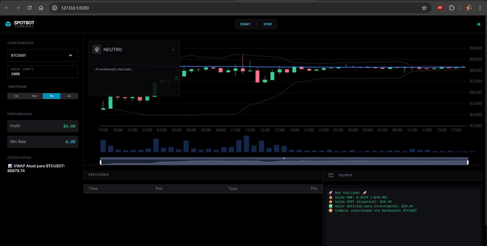

# SpotBot Pro 🚀🤖

**SpotBot Pro** é um robô de trading de criptomoedas automatizado e inteligente, projetado para operar no mercado Spot da Binance. Ele combina análise técnica clássica com o poder da Inteligência Artificial (Google Gemini) para tomar decisões de compra e venda mais assertivas.



## ✨ Funcionalidades Principais

*   **🧠 Análise Híbrida**: Utiliza indicadores técnicos (RSI, MACD, Bandas de Bollinger, VWAP, EMAs) em conjunto com a IA **Gemini 1.5 Flash** para validar entradas.
*   **🖥️ Dashboard Profissional**: Interface web moderna (Dark Mode) construída com **NiceGUI**. Agora com **Sidebar otimizada** e **Card de IA recolhível** para máxima área de visualização gráfica.
*   **📱 Controle via Telegram**: Receba notificações de trades e controle o bot (Inciar, Parar, Status, Saldo) diretamente pelo seu celular.
*   **🛡️ Estabilidade Reforçada**: Proteção robusta contra falhas de API e tratamento de erros críticos (Crash Fixes) para operação contínua 24/7.
*   **🛡️ Gerenciamento de Risco Dinâmico**:
    *   **Stop Loss & Take Profit via ATR**: Ajusta os alvos automaticamente com base na volatilidade do mercado.
    *   **Trailing Stop Inteligente**: Protege seus lucros movendo o Stop Loss automaticamente conforme o preço sobe.
*   **💾 Banco de Dados Robusto**: Armazena todo o histórico de operações em **SQLite**, garantindo integridade e rapidez.
*   **🧪 Sistema de Backtesting**: Simule sua estratégia com dados históricos reais da Binance antes de colocar dinheiro real.
*   **⚙️ Altamente Configurável**: Ajuste sensibilidade de indicadores, pares de moedas, valores de investimento e muito mais.

## 🛠️ Tecnologias Utilizadas

*   **Linguagem**: Python 3.10+
*   **Interface**: NiceGUI
*   **Exchange**: Binance API (via `python-binance`)
*   **IA**: Google Generative AI (Gemini)
*   **Banco de Dados**: SQLite
*   **Notificações**: Telegram Bot API (Async)
*   **Análise de Dados**: Pandas, NumPy, TA-Lib (implementação nativa)

## 🚀 Como Começar

### Pré-requisitos

1.  **Python 3.10** ou superior instalado.
2.  Conta na **Binance** (com chaves de API criadas).
3.  Conta no **Google AI Studio** (para obter a chave da API do Gemini).
4.  Bot no **Telegram** (criado via @BotFather para obter o Token e Chat ID).

### Instalação

1.  Clone este repositório:
    ```bash
    git clone https://github.com/seu-usuario/spotbot-pro.git
    cd spotbot-pro
    ```

2.  Crie um ambiente virtual (recomendado):
    ```bash
    python -m venv venv
    # Windows
    .\venv\Scripts\activate
    # Linux/Mac
    source venv/bin/activate
    ```

3.  Instale as dependências:
    ```bash
    pip install -r requirements.txt
    ```

4.  Configure as variáveis de ambiente:
    *   Renomeie o arquivo `.env.example` para `.env` (se existir) ou crie um novo.
    *   Preencha com suas chaves:
        ```env
        BINANCE_API_KEY=sua_api_key
        BINANCE_API_SECRET=seu_api_secret
        GEMINI_API_KEY=sua_gemini_key
        TELEGRAM_BOT_TOKEN=seu_telegram_token
        TELEGRAM_CHAT_ID=seu_chat_id
        BOT_ENVIRONMENT=mainnet # ou testnet
        ```

### Executando o Bot

#### Via Dashboard (Recomendado)
Para ter acesso à interface gráfica e controles visuais:

```bash
python dashboard.py
```
O dashboard abrirá automaticamente em seu navegador em `http://localhost:8080`.

#### Via Linha de Comando (Headless)
Se preferir rodar apenas o script principal (ideal para servidores):

```bash
python main.py
```

#### Rodando Backtests
Para testar a estratégia com dados passados:

```bash
python backtest.py
```

## 📱 Comandos do Telegram

Interaja com o bot enviando mensagens privadas:

*   `/status`: Exibe o preço atual, RSI, tendência e a última ação do bot.
*   `/saldo`: Mostra seu saldo disponível em USDT e BNB (com conversão aproximada).
*   `/stop`: Para a execução do bot remotamente.
*   `/ajuda`: Lista todos os comandos disponíveis.

## 📂 Estrutura do Projeto

*   `main.py`: O coração do bot. Gerencia o loop de trading e conexões.
*   `dashboard.py`: Interface gráfica web.
*   `decision.py`: Lógica de decisão de compra/venda (Cérebro).
*   `database.py`: Gerenciador do banco de dados SQLite.
*   `telegram_bot.py`: Servidor de comandos do Telegram.
*   `backtest.py`: Motor de simulação de estratégia.
*   `config.py`: Arquivo central de configurações e parâmetros.

## ⚠️ Disclaimer

Este software é para fins educacionais e experimentais. O mercado de criptomoedas é altamente volátil e envolve riscos significativos.
*   **Não invista dinheiro que você não pode perder.**
*   Os desenvolvedores não se responsabilizam por quaisquer perdas financeiras decorrentes do uso deste bot.
*   Teste exaustivamente na **Testnet** ou use o **Backtest** antes de operar com capital real.

---
Feito com ☕ e Python por **Giovanne Botelho**.
