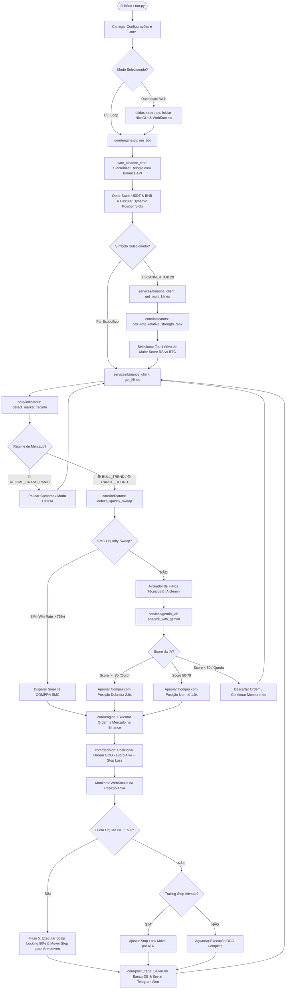

# 🏛️ Documentação Técnica de Arquitetura & Especificação de Sistema (SpotBot Pro)

> **Padrão de Especificação**: Engenharia de Software Quantitativo e Sistemas Críticos (Nível de Alta Confiabilidade / Medical-Grade Engineering).
> **Versão do Sistema**: 2.5.0-QUANT
> **Repositório**: `GiooooBotelho/spotbot`

---

## 📑 Sumário

1. [Visão Geral e Arquitetura de Confiabilidade](#1-visão-geral-e-arquitetura-de-confiabilidade)
2. [Fluxograma Mestre de Execução do Sistema (Mermaid Diagram)](#2-fluxograma-mestre-de-execução-do-sistema)
3. [Detalhamento de Módulos e Especificação Arquivos](#3-detalhamento-de-módulos-e-especificação-de-arquivos)
   - [3.1 Raiz da Aplicação](#31-raiz-da-aplicação)
   - [3.2 Pacote `config/`](#32-pacote-config)
   - [3.3 Pacote `core/` (Núcleo Quantitativo)](#33-pacote-core-núcleo-quantitativo)
   - [3.4 Pacote `services/` (Integrações & Persistência)](#34-pacote-services-integrações--persistência)
   - [3.5 Pacote `ui/` (Interface Web Grafica)](#35-pacote-ui-interface-web-gráfica)
   - [3.6 Pacote `backtest/` (Simulação & Otimização)](#36-pacote-backtest-simulação--otimização)
   - [3.7 Pacote `utils/` (Utilitários & Sanitização)](#37-pacote-utils-utilitários--sanitização)
4. [Matriz de Rastreabilidade, Exceções & Recuperação de Falhas](#4-matriz-de-rastreabilidade-exceções--recuperação-de-falhas)

---

## 1. Visão Geral e Arquitetura de Confiabilidade

O **SpotBot Pro** é uma plataforma assíncrona de negociação algorítmica de alta precisão projetada para operar no mercado Spot da **Binance**. O sistema integra:
- **Matemática Financeira Avançada**: Análise estatística de sérias temporais (Expoente de Hurst, Relative Strength Ratio vs BTC, ADX, RSI, VWAP, ATR, MACD, Bollinger Bands e EMAs 7-200).
- **Microestrutura de Mercado & Smart Money Concepts (SMC)**: Detecção de varreduras de liquidez (*Liquidity Sweeps*) em mínimas de 24h.
- **Inteligência Artificial Generativa (Google Gemini 2.5-Flash)**: Avaliação contextual multivariada que atribui um *Score de Confiança Quantitativo (0 a 100)* e aplica multiplicadores dinâmicos de posição (2.0x para Oportunidades de Ouro).
- **Gerenciamento de Risco Rigoroso**: Alocação de ordens com trava mínima de $10.00 USDT, realização parcial (*Scalp Locking* em +1.5%), proteção em *Breakeven* (Zero a Zero) e *Trailing Stop* conduzido por volatilidade ATR.

---

## 2. Fluxograma Mestre de Execução do Sistema

---

## 3. Detalhamento de Módulos e Especificação de Arquivos

---

### 3.1 Raiz da Aplicação

#### 📄 [`run.py`](file:///c:/Py/spotbot/run.py)
- **Função Principal**: Ponto de entrada unificado da aplicação.
- **Responsabilidade**:
  - Processa argumentos de linha de comando (`--mode dashboard`, `--mode cli`, `--help`).
  - Inicializa o servidor web NiceGUI em [ui/dashboard.py](file:///c:/Py/spotbot/ui/dashboard.py) ou executa o motor diretamente via terminal CLI em [core/engine.py](file:///c:/Py/spotbot/core/engine.py).

---

### 3.2 Pacote `config/`

#### 📄 [`config/settings.py`](file:///c:/Py/spotbot/config/settings.py)
- **Função Principal**: Gerenciador central de parâmetros de configuração e leitura de variáveis de ambiente.
- **Responsabilidade**:
  - Carrega as chaves de API da Binance (Mainnet/Testnet), Telegram e Gemini do arquivo `.env`.
  - Armazena a lista oficial `TOP_20_SYMBOLS` para o modo Scanner Multi-Ativos.
  - Define dicionários operacionais: `TRADING_CONFIG`, `RISK_PROFILES` (Conservador, Moderado, Agressivo), `SCANNER_CONFIG`, `RSI_CONFIG`, `ATR_CONFIG`, `OCO_CONFIG` e `TRAILING_STOP_CONFIG`.

---

### 3.3 Pacote `core/` (Núcleo Quantitativo)

#### 📄 [`core/engine.py`](file:///c:/Py/spotbot/core/engine.py)
- **Função Principal**: Orquestrador assíncrono do ciclo de vida de negociação (*Trading Loop*).
- **Responsabilidade**:
  - **Auto Time Resync**: Executa `sync_binance_time()` a cada 1 hora para eliminar o erro `-1021` (Timestamp drift da Binance API).
  - **Dynamic Slot Allocation**: Calcula o valor por ordem respeitando a trava mínima de $10.00 USDT.
  - **Scanner Mode (Scanner 2.0)**: Executa a busca em lote dos 20 ativos e seleciona a moeda líder por Força Relativa.
  - **Order Execution & OCO Tracking**: Gerencia compras a mercado e escuta eventos de preenchimento via WebSocket (`bsm.user_socket()`).
  - **Scalp Locking & Breakeven (Fase 5)**: Ao atingir $+1.5\%$ de lucro, executa venda parcial de 50%, move o stop loss restante para o *Zero a Zero* e atualiza ordens OCO dinamicamente.

#### 📄 [`core/decision.py`](file:///c:/Py/spotbot/core/decision.py)
- **Função Principal**: Motor de decisão lógica de entrada, dimensionamento e posicionamento de ordens.
- **Responsabilidade**:
  - `calculate_dynamic_position_slots(total_usdt)`: Fraciona o saldo em posições operacionais sem violar o mínimo de $10 USDT.
  - `should_buy(...)`: Avalia se o mercado atende a uma das condições ativadoras:
    - Rejeição por Regime de Pânico (`REGIME_CRASH_PANIC`).
    - Gatilho SMC de Varredura de Liquidez (`detect_liquidity_sweep`).
    - Aprovação pela IA Gemini com multiplicador de posição 2.0x para *Scores $\ge$ 80*.
    - Condições técnicas tradicionais (RSI L0 a L5 + VWAP + MACD + Padrões).
  - `adjust_and_place_oco_order(...)`: Calcula e envia ordens OCO (*Take Profit* e *Stop Loss* ajustados pela volatilidade ATR).

#### 📄 [`core/indicators.py`](file:///c:/Py/spotbot/core/indicators.py)
- **Função Principal**: Biblioteca matemática de indicadores técnicos e estatísticos.
- **Responsabilidade**:
  - `calculate_hurst_exponent(closes)`: Mapeia o Expoente de Hurst ($H$) para diferenciar Reversão à Média ($H < 0.48$) de Tendência ($H > 0.55$).
  - `detect_market_regime(klines)`: Classifica o mercado em `REGIME_BULL_TREND`, `REGIME_RANGE_BOUND` ou `REGIME_CRASH_PANIC`.
  - `detect_liquidity_sweep(klines)`: Identifica espadas de preço abaixo da mínima de 24h com vela de rejeição (pinbar) e pico de volume ($V \ge 1.3\times$).
  - `calculate_relative_strength_rank(multi_klines)`: Rankeia os 20 ativos pelo índice de Força Relativa ($RS\_Ratio = R_{Ativo} - R_{BTC}$) combinado com RSI e ADX.
  - Funções matemáticas universais: `calculate_rsi`, `calculate_macd`, `calculate_bollinger_bands`, `calculate_vwap`, `calculate_adx`, `calculate_atr`, `calculate_ema`.

#### 📄 [`core/patterns.py`](file:///c:/Py/spotbot/core/patterns.py)
- **Função Principal**: Motor de reconhecimento de padrões geométricos de candlestick.
- **Responsabilidade**:
  - Reconhece 17 padrões de velas: Hammer, Shooting Star, Bullish/Bearish Engulfing, Piercing Line, Dark Cloud Cover, Bullish/Bearish Kicker, Long/Short Day, Doji, Dragonfly/Gravestone Doji, Long Legged Doji, Three Line Strike, Rising/Falling Three Methods e Stick Sandwich.

#### 📄 [`core/post_trade.py`](file:///c:/Py/spotbot/core/post_trade.py)
- **Função Principal**: Módulo pós-operacional e processador de resultados líquidos.
- **Responsabilidade**:
  - `process_order_details(...)`: Extrai dados da ordem preenchida da Binance, calcula a taxa de comissão em BNB (com 25% de desconto) e calcula o resultado líquido da operação.
  - `log_and_notify_results(...)`: Exibe relatórios no console e dispara alertas formatados para o Telegram.
  - `save_to_csv(...)`: Persiste os dados históricos da operação em CSV local.

---

### 3.4 Pacote `services/` (Integrações & Persistência)

#### 📄 [`services/binance_client.py`](file:///c:/Py/spotbot/services/binance_client.py)
- **Função Principal**: Camada de abstração e comunicação com a API REST da Binance.
- **Responsabilidade**:
  - `get_multi_klines(client, symbols, interval, limit)`: Busca velas de até 20 pares em paralelo via `asyncio.gather` para alimentar o Scanner.
  - `get_usdt_balance(client)`: Consulta saldo disponível em USDT.
  - `get_bnb_price(client)`: Obtém a cotação do BNB para cálculo exato das taxas.

#### 📄 [`services/gemini_ai.py`](file:///c:/Py/spotbot/services/gemini_ai.py)
- **Função Principal**: Conector com a SDK oficial `google-genai` do Google Gemini (modelo `gemini-2.5-flash`).
- **Responsabilidade**:
  - `analyze_with_gemini(...)`: Envia contexto multivariado do mercado e solicita análise em formato JSON restrito.
  - `interpret_gemini_response(...)`: Interpreta a resposta da IA, extrai o `confidence_score` (0 a 100) e define o multiplicador de posição (2.0x para Oportunidades de Ouro).
  - Possui tratamento de exceção para erros de cota (HTTP 429), ativando modo silencioso de 5 minutos sem travar o sistema.

#### 📄 [`services/database.py`](file:///c:/Py/spotbot/services/database.py)
- **Função Principal**: Gerenciador de banco de dados híbrido (SQLite local / PostgreSQL em nuvem).
- **Responsabilidade**:
  - Cria e gerencia as tabelas `trades`, `performance_logs` e `system_settings`.
  - Suporta migração automática de dados vindos do CSV histórico.
  - Fornece métricas acumuladas via `get_stats()` (Lucro Total Líquido, Win Rate %, Total de Trades).

#### 📄 [`services/telegram_notifier.py`](file:///c:/Py/spotbot/services/telegram_notifier.py)
- **Função Principal**: Bot bidirecional de mensagens e comandos do Telegram.
- **Responsabilidade**:
  - `send_telegram_message(...)`: Envia alertas assíncronos de compras, vendas, realizações parciais e stops.
  - `TelegramBot`: Escuta mensagens de usuários via Long Polling do Telegram e executa comandos ricos (`/status`, `/saldo`, `/top20`, `/scanner`, `/lucro`, `/perf`, `/stop`, `/ajuda`).

---

### 3.5 Pacote `ui/` (Interface Web Gráfica)

#### 📄 [`ui/dashboard.py`](file:///c:/Py/spotbot/ui/dashboard.py)
- **Função Principal**: Terminal Web Institucional construído em NiceGUI e ECharts.
- **Responsabilidade**:
  - Renderiza o layout *Deep Obsidian* com gráfico de velas em tempo real, volume, médias móveis e Bandas de Bollinger.
  - Exibe o Ticker contínuo estilo CoinMarketCap no cabeçalho com cotações ao vivo.
  - Exibe o Card Holográfico da IA Gemini com as justificativas da análise.
  - Permite seleção de símbolos, alternância de timeframes (15m, 1h, Adaptativo) e controle de execução (Iniciar/Parar).

---

### 3.6 Pacote `backtest/` (Simulação & Otimização)

#### 📄 [`backtest/runner.py`](file:///c:/Py/spotbot/backtest/runner.py)
- **Função Principal**: Motor de simulação de dados históricos.
- **Responsabilidade**:
  - Baixa até 365 dias de velas de 15m/1h da Binance e simula a execução do SpotBot Pro barra por barra.
  - Calcula métricas estatísticas finais: Saldo Inicial, Saldo Final, Lucro/Prejuízo Líquido em USDT e %, Win Rate %, Total de Trades, Vitórias e Derrotas.

#### 📄 [`backtest/optimizer.py`](file:///c:/Py/spotbot/backtest/optimizer.py)
- **Função Principal**: Otimizador por Busca em Grade (Grid Search).
- **Responsabilidade**:
  - Testa combinações de hiperparâmetros (RSI thresholds, multiplicadores de ATR, ADX mínimos) para encontrar a configuração mais lucrativa.

---

### 3.7 Pacote `utils/` (Utilitários & Sanitização)

#### 📄 [`utils/formatting.py`](file:///c:/Py/spotbot/utils/formatting.py)
- **Função Principal**: Sanitizador de strings e gerenciador de códigos de cor ANSI.
- **Responsabilidade**:
  - `remove_ansi_codes(text)`: Remove códigos de formatação ANSI de mensagens antes de enviaá-las para o Telegram ou banco de dados.

---

## 4. Matriz de Rastreabilidade, Exceções & Recuperação de Falhas

| Evento de Erro | Módulo Responsável | Mecanismo de Mitigação / Recuperação |
|---|---|---|
| **Binance API Timestamp Error (-1021)** | [core/engine.py](file:///c:/Py/spotbot/core/engine.py) | Captura o erro `-1021`, invoca `sync_binance_time()` para atualizar `client.TIME_OFFSET` e reinicia a busca sem crashar. |
| **Cota Excedida na IA Gemini (HTTP 429)** | [services/gemini_ai.py](file:///c:/Py/spotbot/services/gemini_ai.py) | Entra em Cooldown de 5 minutos, silencia logs e permite que o bot continue operando normalmente com os Filtros Técnicos. |
| **Queda do Servidor / Queda de Conexão** | [core/engine.py](file:///c:/Py/spotbot/core/engine.py) | O socket do WebSocket tenta reconectar automaticamente; se falhar, o loop assíncrono é pausado por 5s antes da nova tentativa. |
| **Ordem USDT Inferior ao Mínimo da Binance** | [core/decision.py](file:///c:/Py/spotbot/core/decision.py) | O método `get_min_notional` consulta o filtro da Binance e o `calculate_dynamic_position_slots` força o piso mínimo de **$10.00 USDT**. |
| **Perda Abrupta de Conexão no Telegram** | [services/telegram_notifier.py](file:///c:/Py/spotbot/services/telegram_notifier.py) | O loop de polling captura exceções de rede e realiza *backoff exponencial* sem travar a execução do bot. |
