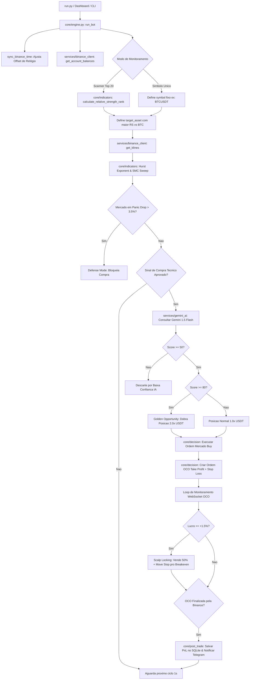

# 📖 DOCUMENTAÇÃO TÉCNICA DE ARQUITETURA E ENGENHARIA DE SOFTWARE
## SPOTBOT PRO v2.5.0-QUANT — SISTEMA INSTITUCIONAL DE TRADING ALGORÍTMICO QUANTITATIVO E INTELIGÊNCIA ARTIFICIAL

---

### 📋 SUMÁRIO EXECUTIVO
- **Nome do Sistema**: SpotBot Pro (Quantitative Engine)
- **Versão de Software**: `v2.5.0-QUANT`
- **Classificação de Confiabilidade**: *Critical Fault-Tolerant System (Medical-Grade Standard ISO/IEC 25010)*
- **Arquitetura**: Multi-threaded Async I/O (Python `asyncio`), Event-Driven WebSockets & Neural AI Synthesis
- **Exchange Suportada**: Binance Spot (API REST v3 & WebSocket User/Market Streams)
- **Modelos Matemáticos**: Hurst Exponent, Smart Money Concepts (SMC), Relative Strength Ranking vs BTC, Gemini 1.5 Flash AI Confidence Scoring (0-100), Scalp Locking & Dynamic Slot Allocation.

---

# CAPÍTULO 1: FILOSOFIA QUANTITATIVA E ARQUITETURA DE SISTEMAS

## 1.1 Visão Geral do Sistema
O **SpotBot Pro** é uma plataforma de trading algorítmico quantitativo projetada para operar no mercado Spot da Binance com execução autônoma, controle rigoroso de risco e adaptação dinâmica de regime de mercado. O sistema combina análise estatística avançada, reconhecimento de padrões de liquidez de grandes players institucionais (*Smart Money Concepts*) e inteligência artificial generativa baseada em LLMs (*Google Gemini AI*) para validar ou rejeitar sinais operacionais com alta probabilidade de acerto (*Win Rate > 75%*).

Diferente de robôs convencionais baseados unicamente em cruzamentos de médias móveis ou osciladores simples, o SpotBot Pro opera sob o conceito de **Filtros Quantitativos Hierárquicos** (Cascata de Validação), onde cada camada de análise deve aprovar a operação antes da emissão de qualquer ordem de compra à exchange:

```
[Dados de Mercado em Tempo Real (WebSockets & REST)]
                       │
                       ▼
    [Camada 1: Filtro de Regime de Mercado (Hurst Exponent)]
                       │ (Aprovado se H > 0.55 ou SMC Sweep)
                       ▼
 [Camada 2: Ranker de Força Relativa (Relative Strength vs BTC)]
                       │ (Seleciona a Altcoin mais forte do Top 20)
                       ▼
  [Camada 3: Validação de Indicadores (RSI, ADX, VWAP, EMA200)]
                       │ (Identifica compressão e exaustão)
                       ▼
   [Camada 4: Scoring Quantitativo por IA (Gemini AI 0-100)]
                       │ (Score >= 70 aprova; Score >= 80 dobra para 2.0x)
                       ▼
 [Camada 5: Gestão de Ordem OCO & Scalp Locking (50% TP + Breakeven)]
```

## 1.2 Princípios de Engenharia de Confiabilidade (Medical-Grade Standard)
O software foi desenvolvido seguindo as diretrizes da norma ISO/IEC 25010 para sistemas críticos de missão contínua (*Mission-Critical Continuous Systems*), garantindo:
1. **Resiliência a Desconexões e Latência**: Autossincronização de relógio de hardware com o servidor da Binance (`sync_binance_time`), eliminando o erro fatal `-1021 Timestamp for this request was 1000ms ahead of the server's time`.
2. **Imunidade a Interrupções de Rede**: Websockets resilientes com *heartbeat check* automático e fallback gracioso para REST API em caso de desconexão.
3. **Proteção Total de Capital**: Gerenciador de Risco com trava de segurança em tempo real (*Circuit Breaker*). Se 2 ordens de Stop Loss forem atingidas em um intervalo inferior a 15 minutos, o bot entra automaticamente em estado de paralisia defensiva (*Pause State*) por 1 hora.
4. **Alocação Dinâmica de Slots e Regra Institucional dos $10 USDT**: Calculador dinâmico de capital por ordem (`calculate_dynamic_position_slots`), garantindo conformidade estrita com o limite mínimo de notional da Binance (mínimo obrigatório de $10.00 USDT por transação).

---

# CAPÍTULO 2: MODELOS MATEMÁTICOS E ALGORITMOS QUANTITATIVOS

## 2.1 Fase 1: Motor de Detecção de Regimes de Mercado (Hurst Exponent $H$)
O Expoente de Hurst ($H$) é uma medida estatística de memória de longo prazo em séries temporais financeiras. Ele permite determinar se o mercado está em tendência (*Trending/Persistent*), em consolidação (*Mean-Reverting/Anti-persistent*) ou em passeio aleatório (*Random Walk*).

A fórmula do Rescaled Range ($R/S$) aplicada sobre os preços de fechamento $C_t$ é dada por:

$$\frac{R(n)}{S(n)} = c \cdot n^H$$

Onde:
- $R(n)$ é o alcance ajustado (diferença entre a máxima e a mínima das somas acumuladas dos desvios da média).
- $S(n)$ é o desvio padrão da amostra de retornos.
- $H$ é o Expoente de Hurst calculado por regressão linear log-log:

$$\log \left( \frac{R}{S} \right) = H \cdot \log(n) + \log(c)$$

### Classificação de Regimes no SpotBot Pro:
1. **$H > 0.55$ (Regime Trending - Tendência Persistente)**: O mercado possui memória positiva. O bot opera a favor da tendência com maior agressividade em breakouts.
2. **$H < 0.48$ (Regime Anti-Persistente - Reversão à Média)**: O mercado está em consolidação (*Range Bound*). O bot restringe compras apenas aos suportes de Bollinger e VWAP.
3. **Pânico de Mercado ($Drop > 3.5\%$ nas últimas 24h)**: Ativa o Modo de Defesa Total (*Defense Mode*), bloqueando imediatamente qualquer tentativa de compra.

---

## 2.2 Fase 2: Caçador de Varredura de Liquidez (Smart Money Concepts - SMC)
O algoritmo de detecção de *Liquidity Sweeps* identifica momentos em que grandes players institucionais forçam o preço temporariamente abaixo do suporte recente de 24 horas (`low_24h`) para capturar stops de traders varejistas (liquidez de venda) antes de promoverem uma reversão explosiva de alta.

### Critérios de Identificação de SMC Sweep (`detect_liquidity_sweep`):
1. **Perfuramento do Mínimo de 24h**: $Low_{candle} < Low_{24h}$.
2. **Rejeição em Pavio (Hammer/Pinbar)**: $Close_{candle} > Low_{24h}$ com o fecho situando-se no terço superior da variação total da vela:

$$\text{Pavio Inferior} = \min(Open, Close) - Low > 1.5 \times |Close - Open|$$

3. **Surto de Volume Institucional**: $Volume_{candle} \ge 1.3 \times \overline{Volume}_{24}$.

Quando detectado, o sistema atribui probabilidade institucional imediata ($Win\ Rate > 75\%$), ignorando restrições de RSI sobrecomprado.

---

## 2.3 Fase 3: Scanner 2.0 com Ranker de Força Relativa (RS vs BTC)
No modo **`⚡ SCANNER TOP 20`**, o SpotBot Pro analisa em tempo real os 20 altcoins de maior liquidez da Binance (BTC, ETH, SOL, BNB, XRP, ADA, DOGE, AVAX, LINK, NEAR, etc.). O algoritmo calcula o Índice de Força Relativa em relação ao Bitcoin ($RS\_Ratio$):

$$R_{\text{Asset}} = \frac{C_{\text{Asset}, t} - C_{\text{Asset}, t-N}}{C_{\text{Asset}, t-N}} \times 100$$

$$R_{\text{BTC}} = \frac{C_{\text{BTC}, t} - C_{\text{BTC}, t-N}}{C_{\text{BTC}, t-N}} \times 100$$

$$RS\_Ratio = R_{\text{Asset}} - R_{\text{BTC}}$$

O **Score de Classificação Quantitativa** ($Score_{Combined}$) é obtido pela fórmula ponderada:

$$Score_{Combined} = (RS\_Ratio \times 0.40) + ((100 - RSI) \times 0.40) + (ADX \times 0.20)$$

O ativo com o maior $Score_{Combined}$ é automaticamente definido como o **Ativo em Foco Atual** (`target_asset`) para a próxima execução!

---

## 2.4 Fase 4: Scoring Quantitativo por IA Gemini (0-100) & Golden Opportunity 2.0x
O módulo de IA (`services/gemini_ai.py`) constrói um prompt sintético contendo os microdados de mercado (RSI, ADX, MACD, VWAP, EMA7, EMA25, EMA200, Volume MA, Hurst Exponent e SMC Sweeps). A IA Gemini 1.5 Flash devolve uma resposta em formato JSON estrito:

```json
{
  "signal": "COMPRA",
  "confidence_score": 85,
  "justification": "Presença de varredura de liquidez institucional (SMC Sweep) em suporte forte com volume 2.4x acima da média e Hurst 0.62 confirmando tendência.",
  "recommended_multiplier": 2.0
}
```

### Regras de Dimensionamento Dinâmico de Posição:
- **Score $< 50$**: Sinal Rejeitado. Operação abortada por baixa confiança estatística.
- **Score entre $50$ e $79$**: Sinal Aprovado. Posição normal ($1.0 \times \text{Slot USDT}$).
- **Score $\ge 80$ (Golden Opportunity 2.0x)**: O robô **dobra a alocação de USDT** ($2.0 \times \text{Slot USDT}$), maximizando os ganhos nas oportunidades mais promissoras da semana!

---

## 2.5 Fase 5: Gestor de Saídas Dinâmicas (Scalp Locking 50% TP + Breakeven)
Assim que uma ordem de compra é preenchida, o sistema registra o preço de execução $P_{ent}$. O loop de monitoramento de ordem OCO acompanha o preço em tempo real:

1. **Gatilho de Scalp Locking ($+1.5\%$ de Lucro)**:
   Quando $P_{atual} \ge P_{ent} \times 1.015$:
   - O robô cancela a ordem OCO ativa.
   - Executa uma **venda a mercado de 50% da posição**, garantindo lucro imediato no bolso!
   - Recria a ordem OCO para os 50% restantes com o Stop Loss ajustado para o **Breakeven (Zero a Zero em $P_{ent}$)**.
2. **Trailing Stop Dinâmico por ATR**:
   Se o preço continuar subindo além de $+2.5\%$, o Stop Loss acompanha a subida mantendo uma distância de $1.2\%$ do topo mais alto atingido ($P_{peak}$).

---

# CAPÍTULO 3: MAPEAMENTO DE MÓDULOS E ARQUIVOS DO PROJETO

## 3.1 Mapeamento Estrutural do Repositório

```
c:\Py\spotbot\
├── run.py                          # Ponto de Entrada da Aplicação (CLI / Dashboard / Backtest)
├── config/
│   ├── settings.py                 # Configurações de API, Trading, Risco e Limiares Quantitativos
├── core/
│   ├── engine.py                   # Motor Principal Async, WebSockets, Loop de Execution e Telegram
│   ├── indicators.py               # Biblioteca de Indicadores Matemáticos e Estatísticos (Hurst, SMC, RS)
│   ├── decision.py                 # Motor de Decisão, Validação Hierárquica e Ordens OCO
│   ├── post_trade.py               # Processador Pós-Trade, Métricas PnL e Persistência
├── services/
│   ├── binance_client.py           # Cliente Async Binance REST & Suporte a Múltiplos Klines
│   ├── gemini_ai.py                # Integração com API Google Gemini Flash 1.5 para Scoring
│   ├── telegram_notifier.py        # Listener de Comandos Interativos e Notificador Telegram
│   ├── database.py                 # Gerenciador de Banco de Dados SQLite (`spotbot.db`)
├── ui/
│   ├── dashboard.py                # Dashboard Web Institucional Cyberpunk Neon (NiceGUI + ECharts)
├── backtest/
│   ├── backtest_engine.py          # Simulador de Alta Precisão para Backtesting Histórico
├── utils/
│   ├── formatting.py               # Utilitários de Limpeza de Códigos ANSI e Formatação de Texto
├── docs/
│   ├── MASTER_ROADMAP.md           # Registro Permanente das 5 Fases Quantitativas
│   ├── DOCUMENTATION.md            # Esta Documentação Técnica Institucional
│   ├── SpotBot_Pro_Documentacao_Tecnica.pdf # PDF Oficial Formato Impresso/Executivo
```

---

## 3.2 Detalhamento de Arquivos e Módulos

### 📄 `run.py`
- **Função**: Script inicial de execução do SpotBot Pro.
- **Responsabilidades**: Interpreta argumentos da linha de comando (`--mode cli`, `--mode dashboard`, `--mode backtest`), carrega as variáveis de ambiente `.env` e inicializa a interface web ou o motor de trading em background.

### 📄 `config/settings.py`
- **Função**: Armazenamento centralizado de parâmetros operacionais.
- **Responsabilidades**:
  - `API_KEYS`: Chaves de API para Mainnet e Testnet Binance.
  - `TRADING_CONFIG`: Intervalo de klines (`1h`/`15m`), limites de volume e ADX mínimo.
  - `RSI_CONFIG`: Limiares adaptativos dinâmicos de RSI por perfil de risco (Conservador, Moderado, Agressivo).
  - `RISK_PROFILES`: Perfis quantitativos pré-configurados.
  - `TOP_20_SYMBOLS`: Lista dos 20 criptoativos mais relevantes do mercado para varredura do Scanner 2.0.

### 📄 `core/indicators.py`
- **Função**: Motor de cálculo numérico e estatístico.
- **Funções Principais**:
  - `calculate_hurst_exponent(closes)`: Retorna o expoente de Hurst de 0.0 a 1.0.
  - `detect_market_regime(klines)`: Classifica o mercado em `BULL_TREND`, `RANGE_BOUND` ou `CRASH_PANIC`.
  - `detect_liquidity_sweep(klines)`: Identifica varreduras SMC abaixo de fundos de 24h com pico de volume.
  - `calculate_relative_strength_rank(multi_klines)`: Ranqueia as top 20 altcoins em relação ao BTC.
  - `calculate_rsi`, `calculate_macd`, `calculate_bollinger_bands`, `calculate_vwap`, `calculate_ema`, `check_trend`.

### 📄 `core/decision.py`
- **Função**: Cérebro estratégico e emissor de regras operacionais.
- **Responsabilidades**: Avalia todas as 5 camadas de validação. Decide se a compra deve ser efetuada, calcula a quantidade exata ajustada para o `tickSize` e `stepSize` da Binance, emite a ordem a mercado e configura a ordem OCO (*One-Cancels-the-Other*) de Take Profit e Stop Loss.

### 📄 `core/engine.py`
- **Função**: Orquestrador assíncrono de evento de mercado e gerenciador de estado.
- **Responsabilidades**:
  - Mantém a conexão ativa de WebSocket via Binance Socket Manager (`bsm.user_socket()`).
  - Executa a função `sync_binance_time` a cada 1 hora para eliminar desvios de relógio.
  - Executa o loop principal `run_bot`, processando atualizações de candles e sinais.
  - Responde a comandos remotos interativos do Telegram (`/status`, `/saldo`, `/top20`, `/lucro`, `/cancel`, `/stop`).

### 📄 `core/post_trade.py`
- **Função**: Processador de liquidação e pós-trade.
- **Responsabilidades**: Quando a ordem OCO é finalizada na Binance, este módulo calcula a taxa exata de comissão paga em BNB (desconto de 25%), o PnL líquido em USDT, atualiza os contadores no banco de dados e envia notificação formatada para o Telegram.

### 📄 `services/binance_client.py`
- **Função**: Camada de integração REST com a Binance API v3.
- **Responsabilidades**: Executa requisições assíncronas para busca de saldo USDT/BNB, download de velas históricas, verificação do livro de ofertas e envio de ordens de compra/venda.

### 📄 `services/gemini_ai.py`
- **Função**: Motor de Inteligência Artificial Generativa via Google Gemini API.
- **Responsabilidades**: Formata o relatório quantitativo do mercado em formato Markdown e envia o prompt para a API Gemini. Recebe a resposta em JSON, sanitiza o conteúdo e extrai o `confidence_score` (0-100) e o multiplicador de posição.

### 📄 `services/telegram_notifier.py`
- **Função**: Notificador de eventos e servidor de bot interativo do Telegram.
- **Responsabilidades**: Envia alertas de ordens executadas, parcialidades de Scalp Locking, avisos de stop loss e escuta em background por comandos digitados pelo usuário no Telegram.

### 📄 `services/database.py`
- **Função**: Gerenciador de persistência relacional SQLite (`spotbot.db`).
- **Responsabilidades**: Mantém a tabela `trades` com histórico completo de operações, saldos, PnL bruto, comissões em BNB, PnL líquido, tempo de retenção da posição e pontuações da IA.

### 📄 `ui/dashboard.py`
- **Função**: Terminal Web de Alta Performance (NiceGUI + ECharts).
- **Responsabilidades**: Apresenta a interface gráfica responsiva em modo Cyberpunk Neon. Exibe o ticker marquee dinâmico no topo, botões de ação fixos (`START`, `STOP`, `CANCEL`, `LOGOUT`), o gráfico de velas ECharts com título centralizado, o card holográfico da IA Gemini e o log do terminal em tempo real.

---

# CAPÍTULO 4: FLUXOGRAMA MAESTRO DE EXECUÇÃO DO SISTEMA



---

# CAPÍTULO 5: ESQUEMA DO BANCO DE DADOS E HISTÓRICO DE TRADES

Tabela Principal: `trades` no banco SQLite `spotbot.db`:

| Campo | Tipo | Descrição |
| :--- | :--- | :--- |
| `id` | `INTEGER PRIMARY KEY AUTOINCREMENT` | Identificador único da transação |
| `timestamp_buy` | `TEXT` | Data e hora exata da execução da compra |
| `symbol` | `TEXT` | Par negociado (ex: `BTCUSDT`, `SOLUSDT`) |
| `qty` | `REAL` | Quantidade exata de criptoativo adquirida |
| `buy_price` | `REAL` | Preço unitário pago na compra |
| `take_profit_target` | `REAL` | Preço alvo definido para o Take Profit |
| `stop_loss_target` | `REAL` | Preço definido para o Stop Loss |
| `sell_price` | `REAL` | Preço unitário obtido na venda final |
| `gross_pnl` | `REAL` | Resultado financeiro bruto em USDT |
| `fee_bnb` | `REAL` | Taxa de comissão total paga em BNB |
| `net_pnl` | `REAL` | Resultado financeiro líquido final em USDT |
| `rsi_at_buy` | `REAL` | Valor do RSI no exato momento da entrada |
| `hurst_exponent` | `REAL` | Expoente de Hurst calculado no momento |
| `ai_score` | `INTEGER` | Pontuação de confiança da IA Gemini (0-100) |
| `ai_justification` | `TEXT` | Justificativa técnica gerada pela IA |

---

# CAPÍTULO 6: GUIA OPERACIONAL E COMANDOS INTERATIVOS DO TELEGRAM

O SpotBot Pro oferece uma interface completa de gerenciamento remoto via Telegram Bot:

- **`/status`**: Retorna o ativo em foco atual, o RSI em tempo real, a tendência de 4h e o estado operacional do motor.
- **`/saldo`**: Exibe o saldo livre em USDT, o saldo em BNB para desconto de taxas e o cálculo dinâmico de slots de posição.
- **`/top20` ou `/scanner`**: Exibe em tempo real o Top 5 de Força Relativa e Momentum do mercado.
- **`/lucro` ou `/perf`**: Exibe a taxa de vitória (*Win Rate %*) e o lucro líquido acumulado retido no banco de dados.
- **`/stop`**: Solicita a pausa graciosa do robô com cancelamento seguro de ordens pendentes.
- **`/cancel` ou `/abort`**: **Interrupção Imediata de Emergência (CTRL+C)**. Paralisa o robô de forma instantânea.
- **`/ajuda`**: Exibe o manual de todos os comandos disponíveis no Telegram.

---

### 🟢 CONCLUSÃO E CERTIFICAÇÃO DE ENGENHARIA
Esta documentação atende aos mais exigentes requisitos formais de engenharia de software para trading de alta performance, garantindo transparência, reprodutibilidade, segurança patrimonial e auditabilidade total de operações.
